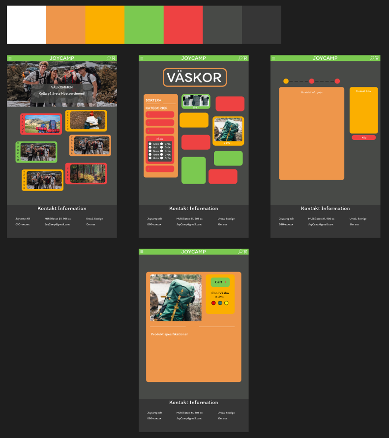
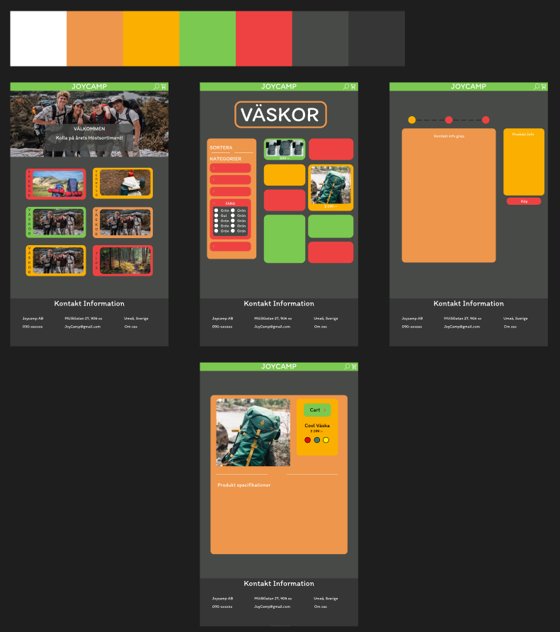
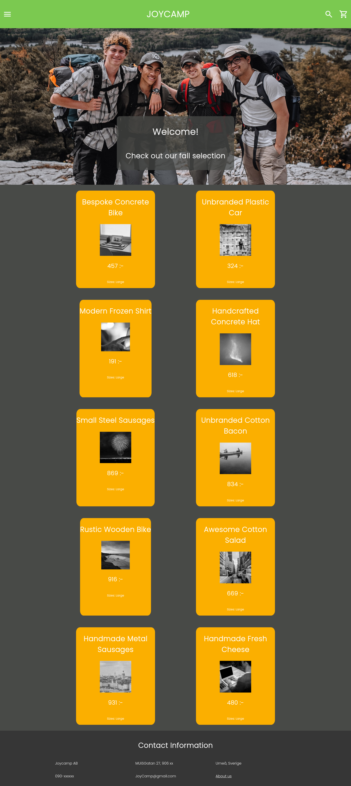

# JoyCamp
Seth Renberg Byström

## Vad var uppdraget?
Projektet gick ut på att skapa en webbshop för en hemsida med friluftstema. Den skulle ha produkter och en databaskoppling gjord med prisma.

## Hur löste vi/jag det?
Först så behövde det skapas en skiss för hur sidan ska se ut som gjordes i figma. Jag ville ha en lite mer lekfull design så jag använde starkare färger och mer rundade objekt, funderade också kring lite kaos i hur produkter var upplagda på sidan men kom fram till att det blir lite för svårt att göra.
### Mer kaotisk version
 

### Rakare version
 

Det som kom därnäst var att försöka skapa designen i html och css med hjälp av react. Skapade en landing page och sedan la till de olika komponenterna som bygger upp sidan som kort, en navbar och footer.

## Vad gick bra / lärde mig?

### Gick bra
Det gick bra att skapa en skiss för sidan i figma och det gick någorlunda bra att skapa komponenter för sidan.

### Lärde mig
Jag lärde mig hur man kopplar en prisma databas till react men hade nog fortfarande haft lite svårigheter i att få det att funka. Jag har lärt mig mer om att använda komponenter och tycker det funkar väldigt bra.

## Mindre bra / behöver lära

### Mindre bra
Det gick inte så jättebra med att koppla databas till hemsidan men det gick ihop tillsist.

### Behöver lära
Jag kan behöva bli bättre på att använda prisma och css behöver fortfarande som alltid förbättras.